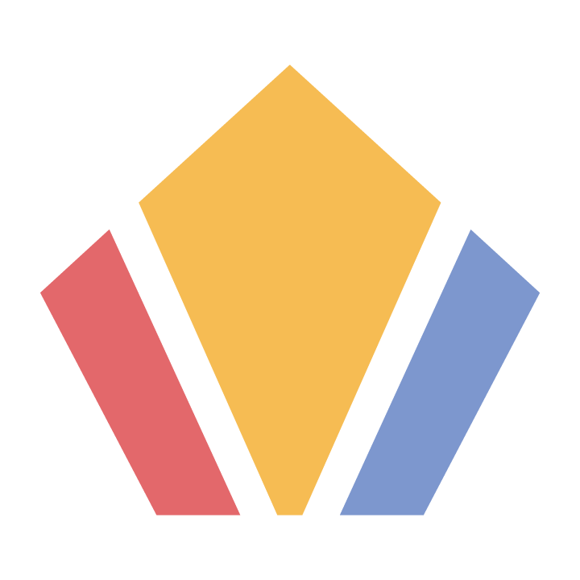

<!-- PROJECT SHIELDS -->
<!--
*** I'm using markdown "reference style" links for readability (but basic href links for the html).
*** Reference links are enclosed in brackets [ ] instead of parentheses ( ).
*** See the bottom of this document for the declaration of the reference variables
*** for contributors-url, forks-url, etc. This is an optional, concise syntax you may use.
*** https://www.markdownguide.org/basic-syntax/#reference-style-links
-->

[![Contributors][contributors-shield]][contributors-url]
[![Issues][issues-shield]][issues-url]
[![MIT License][license-shield]][license-url]


<!-- PROJECT LOGO -->
<br />

<div align="center">

  <a href="http://www.oyfaatuva.com">
    </img>
  </a>

  <h3 align="center">OYFA Website - React</h3>

  <p align="center">
    A website for the Organization of Young Filipino Americans, authored by 36th Webmasters 2023: Colby Le
    <br />
    <br />
    Though there have been previous OYFA websites, this particular iteration arose out of a need for a frameworked model. Previous sites were prone to spaghetti code and disorganization over time as the site expanded. The goal with this project was to provide reusable and adaptive components, enforce strict organization, write detailed documentation, and add the capabilities of Javascript and a modern web framework so that Webmasters of the future have no roadblocks for new features and rapid maintenance.
    <br />
    <br />
    This website is designed to be not only a hub for all Oyfans, but as a model for all other student organizations interested in a website. In keeping with this goal, we have also produced a Quickstart Guide for anyone looking to produce a similar project.<a href="https://docs.google.com/document/d/1HpFqOiBeCmaiBkAtqW8r5TP6nRBN87xtmmukSb8xgnA/edit?usp=sharing" ><strong>View Quickstart Guide »</strong>
    </a>
  </p>
</div>
<br />


<!-- TABLE OF CONTENTS -->
<details align="center">
  <summary><strong>Table of Contents</strong></summary>
  <ol>
    <li>
      <a href="#about-the-project">About The Project</a>
      <ul>
        <li><a href="#built-with">Built With</a></li>
      </ul>
    </li>
    <li>
      <a href="#getting-started">Getting Started</a>
      <ul>
        <li><a href="#prerequisites">Prerequisites</a></li>
        <li><a href="#installation">Installation</a></li>
      </ul>
    </li>
    <li><a href="#usage">Usage</a></li>
    <li><a href="#roadmap">Roadmap</a></li>
    <li><a href="#contributing">Contributing</a></li>
    <li><a href="#license">License</a></li>
    <li><a href="#contact">Contact</a></li>
  </ol>
</details>
<br />

<!-- ABOUT THE PROJECT -->
## About The Project

[![Product Name Screen Shot][product-screenshot]](http://www.oyfaatuva.com)

<p align="right">(<a href="#readme-top">back to top</a>)</p>

### Built With

* [![React][React.js]][React-url]
* [![Bootstrap][Bootstrap.com]][Bootstrap-url]

<p align="right">(<a href="#readme-top">back to top</a>)</p>


<!-- GETTING STARTED -->
## Getting Started

The project uses Node.js as a development platform, GIT as version control, and github for file management. VSCode is recommended as the preferred text editor.

### Prerequisites

1. Install VSCode: https://code.visualstudio.com/download
    * Configure your preferred JS, React, and CSS settings
    * Open up a terminal
    * Set up integrated version control
3. Download Node.js: https://nodejs.org/en/download
4. Install the latest version of the npm package manager:
    ```sh
    npm install npm@latest -g
    ```

### Installation

1. Clone the repo
   ```sh
   git clone https://github.com/colbyle25/website.git
   ```
2. Checkout to an existing dev branch
   ```sh
   git checkout dev
   ```
   or create your own
   ```sh
   git branch new_branch; git checkout new_branch
   ```
3. Install NPM packages
   ```sh
   npm install
   ```
4. Launch your new project view
   ```sh
   npm start
   ```

<p align="right">(<a href="#readme-top">back to top</a>)</p>


<!-- USAGE EXAMPLES -->
## Usage

Documentation is available directly in every source code file. The primary pattern used is to provide data as arrays/dictionaries,
pass those arrays as props to child Components, which then dynamically map over the arrays and produce some repetitive elements.

<p align="right">(<a href="#readme-top">back to top</a>)</p>


<!-- ROADMAP -->
## Roadmap

- [ ] Leadership Archive
- [ ] State-based maintenance form to replace Constants.js
- [ ] Implement multiple-paragraph B&C bios, with links to social media/spotifys
- [ ] Style overhaul
    - [ ] Get feedback from all Oyfans and PR committee
- [ ] HTTPS certificate
- [ ] Overhaul Links, Archives, and Events

See the [open issues](https://github.com/colbyle25/website/issues) for a full list of proposed features (and known issues).

<p align="right">(<a href="#readme-top">back to top</a>)</p>


<!-- CONTRIBUTING -->
## Contributing

The OYFA Website will always be an open source project in line with its shared use amongst all Oyfans and peer student organizations.
The Webmasters **greatly welcome** any admissible contributions which improve the user experience for all visitors and benefactors of the website.

Please fork the repo and create a pull request. You can also simply open an issue with the tag "enhancement".

1. Fork the Project
2. Create your Feature Branch (`git checkout -b feature/AmazingFeature`)
3. Commit your Changes (`git commit -m 'Add some AmazingFeature'`)
4. Push to the Branch (`git push origin feature/AmazingFeature`)
5. Open a Pull Request

<p align="right">(<a href="#readme-top">back to top</a>)</p>


<!-- LICENSE -->
## License

Distributed under the MIT License. See `LICENSE.txt` for more information.

<p align="right">(<a href="#readme-top">back to top</a>)</p>


<!-- CONTACT -->
## Contact

Current OYFA Webmasters - [@oyfaatuva](https://www.instagram.com/oyfaatuva/) - oyfaatuvawebmasters@gmail.com

Author - colby.le.623@gmail.com

Project Link: [https://github.com/colbyle25/website](https://github.com/colbyle25/website)

<p align="right">(<a href="#readme-top">back to top</a>)</p>


<!-- MARKDOWN LINKS & IMAGES -->
<!-- https://www.markdownguide.org/basic-syntax/#reference-style-links -->
[contributors-shield]: https://img.shields.io/github/contributors/colbyle25/website.svg?style=for-the-badge
[contributors-url]: https://github.com/colbyle25/website/graphs/contributors
[forks-shield]: https://img.shields.io/github/forks/colbyle25/website.svg?style=for-the-badge
[forks-url]: https://github.com/colbyle25/website/network/members
[stars-shield]: https://img.shields.io/github/stars/colbyle25/website.svg?style=for-the-badge
[stars-url]: https://github.com/colbyle25/website/stargazers
[issues-shield]: https://img.shields.io/github/issues/colbyle25/website.svg?style=for-the-badge
[issues-url]: https://github.com/colbyle25/website/issues
[license-shield]: https://img.shields.io/github/license/colbyle25/website.svg?style=for-the-badge
[license-url]: https://github.com/colbyle25/website/blob/master/LICENSE.txt
[product-screenshot]: public/Images/_Common/README_Product_Screenshot.png
[React.js]: https://img.shields.io/badge/React-20232A?style=for-the-badge&logo=react&logoColor=61DAFB
[React-url]: https://reactjs.org/
[Bootstrap.com]: https://img.shields.io/badge/Bootstrap-563D7C?style=for-the-badge&logo=bootstrap&logoColor=white
[Bootstrap-url]: https://getbootstrap.com